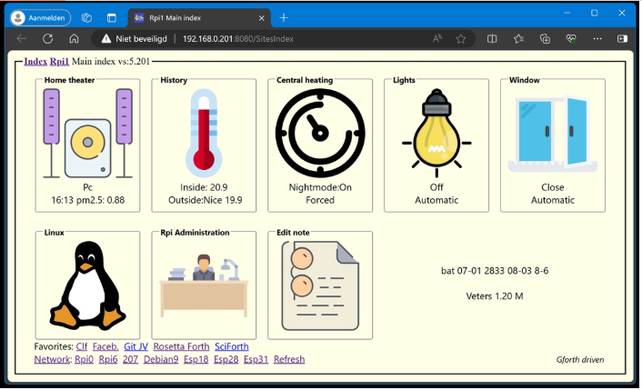
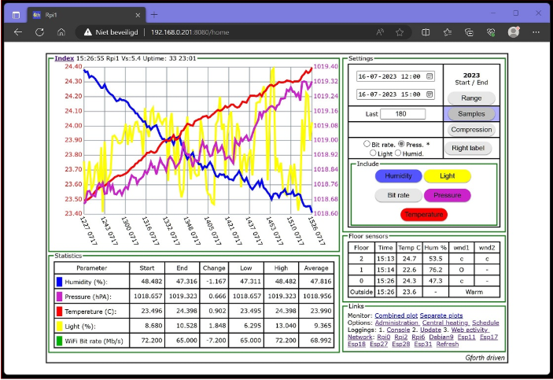

# Github 上的 F83 專案

## F83

* [ForthHub 的 F83](https://github.com/ForthHub/F83) 收錄 F83 8086 V2 的原始程式。
* [ForthHub 的 OneForth](https://github.com/ForthHub/OneForth) 收錄 F83 Atari ST computers 原始程式。
* [Janaite 的 forth83-80](https://github.com/janaite/forth83-80) 收錄 Forth F83 v2.0 for CP/M-80 by Laxen & Perry

## FPC

* [jimmydevice_68K-multitasking-forth](https://github.com/jimmydevice/68K-multitasking-forth) 68K multitasking forth with graphics and touch FPC-500 1990

## Win32Forth

* [BillRagsdale 的 WIN32Forth-Guide](https://github.com/BillRagsdale/WIN32Forth-Guide) 收錄 Win32Forth 的使用手冊
* [Jos-Ven 的 A-smart-home-in-Forth](https://github.com/Jos-Ven/A-smart-home-in-Forth) 使用 Win32Forth 來開發智慧家庭物聯網應用

## OpenFirmware 

* [openbios 的 openbios](https://github.com/openbios/openbios) OpenFirmware 的原始碼
* [MitchBradley 的 openfirmware](https://github.com/MitchBradley/openfirmware) Open Firmware (IEE1275-1994) implementation by its inventor.

## Forth 開發的遊戲

* [chipwits 的 chipwits-forth](https://github.com/chipwits/chipwits-forth) Macintosh and Commodore 64 raw disk images from the archives of the original author of ChipWits, Doug Sharp.

