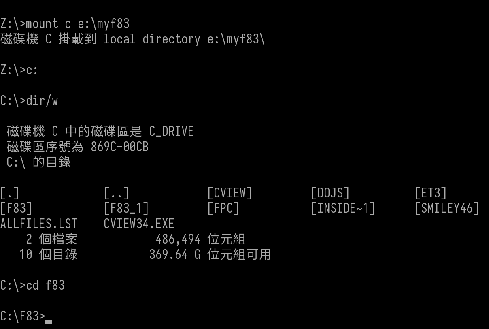
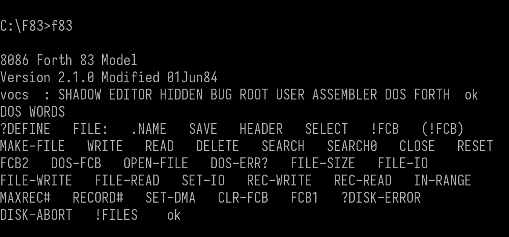

# 在 Windows 11 環境中安裝 DOSBox 

## 使用 Winget 安裝 DOSBox-X

如果您是使用 Win10 22H2 或 Win11 以上的系統，您就有 winget 套件管理系統可以使用，開啟終端機，執行底下的指令就能安裝 **DOSBox-X**。

```
C:\Users\daniel>winget search dosbox
名稱            識別碼                      版本       相符        來源
-------------------------------------------------------------------------
DOSBox          DOSBox.DOSBox               0.74-3                 winget
DOSBox Staging  DOSBoxStaging.DOSBoxStaging 0.82.2     Tag: dosbox winget
DOSBox-X        joncampbell123.DOSBox-X     2025.05.03 Tag: dosbox winget
DOSBox SVN-Daum ykhwong.DOSBoxSVN-Daum      20150125               winget

C:\Users\daniel>winget install joncampbell123.DOSBox-X
```

## 基本使用

1. 找到 DOS 下的應用程式
2. 掛載磁碟機上的目錄
3. 執行程式

我們用 F83 與 F-PC 軟體來做基本介紹


## F83 



```
Z:\>mount c e:\myF83
Z:\>c:
C:\>dir/w
C:\>cd F83
```


## F-PC

```
C:\>cd fpc
C:\FPC>F-PC.EXE
```

