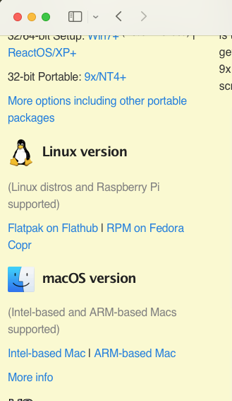
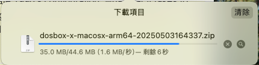
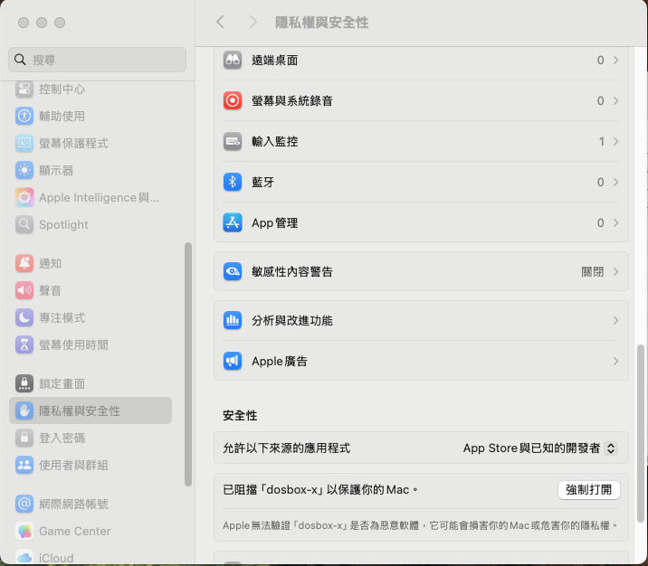
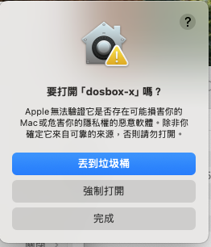
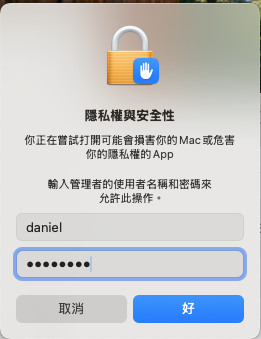
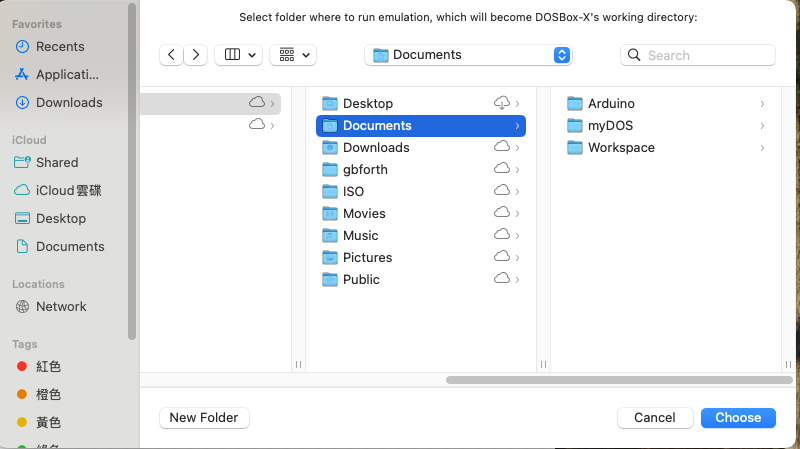
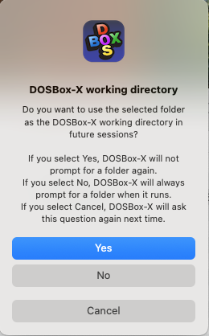
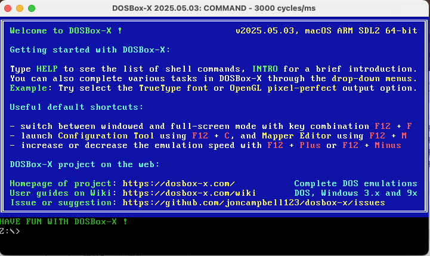
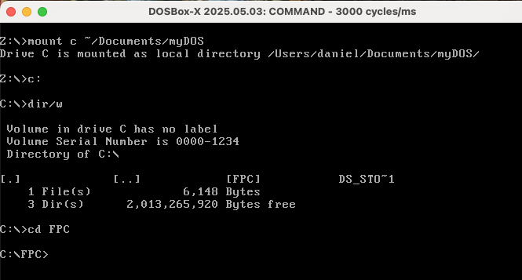
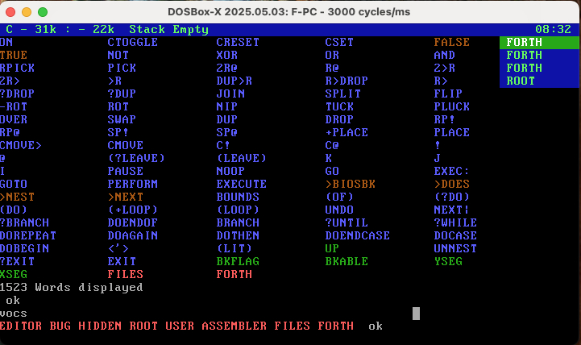

# 在 OSX 中安裝 DOSBox

## 下載 OSX 可用的版本

OSX 作業系統目前有芬 Intel-based 與 ARM-based 兩種版本。本次測試使用的電腦為 Mac Mini M4，所以要選擇下載 **ARM-based 版本**。



下載軟體。



## 安裝與設定軟體

由於 OSX 安全性較嚴格的問題，所有網際網路上下載下來非認證過的軟體都無法直接開啟執行。請到系統設定，找到 **隱私權與安全性** ，點選 **安全性**，在「已阻擋 「dosbox-x」以保護你的Mac」，選擇 **強制打開**。



預設還是會提示你將無法驗證的軟體丟到垃圾桶，請不要直接按預設選項，請改成「強制打開」。因為我們知道我們今天就是要來使用 DOSBox-X。



要使用非驗證的軟體，需要輸入使用者的密碼。




軟體使用需要設定分享的給 DOSBox 的目錄。原則上我們會在個人家目錄的文件夾中設定一個 **myDOS** 的目錄，建立好目錄後，選擇「Choose」。



選擇 **YES**



第一次開啟的畫面




## 測試 F-PC 執行是否正常

掛在目錄跟 Windows 作業系統不一樣。 OSX 與 Linux 系統都屬於 Unix 類作業系統，沒有C、D等磁碟機概念。所以我們要輸入 **~/Documents/myDOS**，就是我們前面設定的檔案分享目錄。

1. 掛載目錄  `mount C ~/Documents/myDOS`
2. 切換磁碟機 `c:`
3. 列出檔案清單 `dir/w`
4. 切換到 FPC 目錄 `cd FPC`
5. 執行 F-PC.exe，啟動 FPC。 `F-PC.exe`



進去 F-PC 軟體後，我們可以輸入 `vocs` 來確認 FPC 軟體會正確回傳執行結果。你會看到軟體回傳一串紅色字串，

```
EDITOR BUG HIDDEN ROOT USER ASSEMBLER FILES FORTH
```

這就代表軟體可正常使用。



要結束軟體，請輸入 `bye` 指令，就會回到 DOS 環境，再輸入 `exit`，就會關閉 DOSBox-X 軟體。
