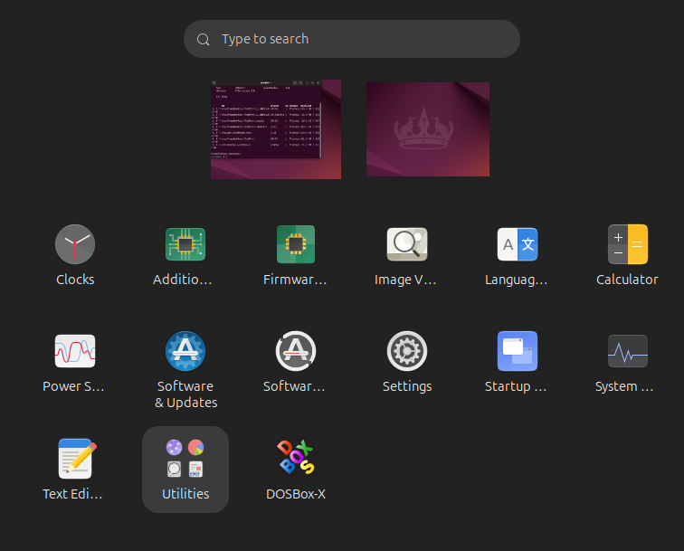

# 在 Linux 環境中安裝 DOSBox

目前 DOSBox-X 在 Linux 作業系統只有支援 flathub 安裝

[flathub 安裝 DOSBox-X 步驟](https://flathub.org/en/apps/com.dosbox_x.DOSBox-X)

```
flatpak install flathub com.dosbox_x.DOSBox-X
```

## 在 Ubuntu 環境下安裝 DOSBox 

1. 輸入安裝指令 `flatpak install flathub com.dosbox_x.DOSBox-X`


2. 系統會列出要安裝的套件清單


3. 安裝好後，搜尋可以找到 **DOSBox-X** 程式。



4. 第一次進入程式會要求要建立 DOSBox-X 的工作目錄，預設我們設定在 `/home/user/Documents/myDOS`


5. 啟動 DOSBox-X


6. 掛載磁碟機，然後進入到 F-PC 環境。

```
mount c /home/user/myDOS
c:
dir/w
cd fpd
F-PC.exe
```


