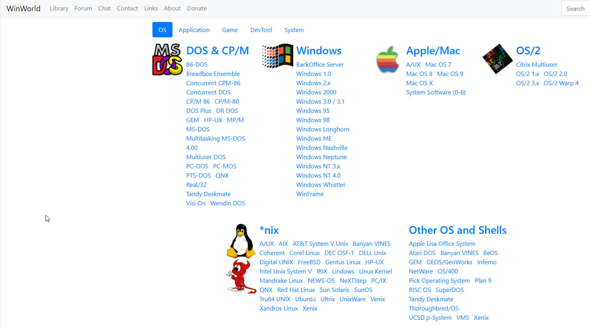
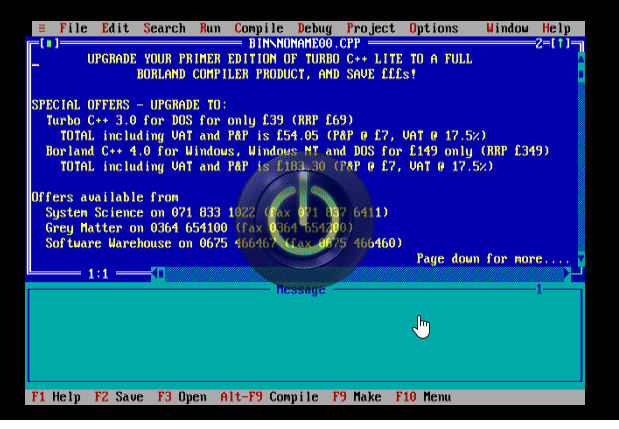
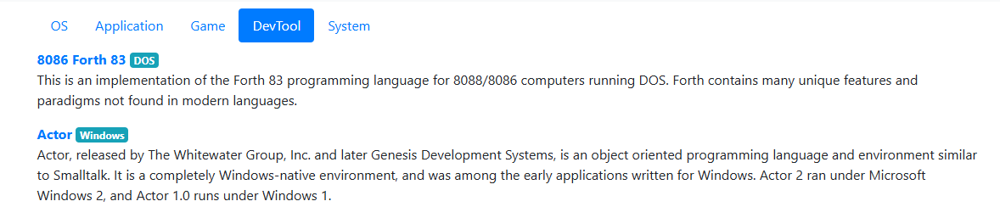
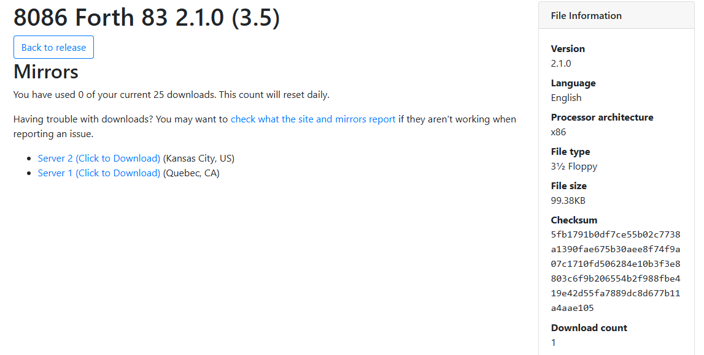

# 如何尋找早期的 DOS 作業系統與應用程式

要能讓過去的 DOS 作業系統與軟體重新執行，雖已有模擬器，但最需要的還是軟體與操作手冊。

DOS 作業系統活躍的年代是還沒有現今的網際網路，加上當時的儲存檔案的方式都以磁碟片為主。即使你現在還有外接式磁碟機，但想讀出過去保存的磁碟，其實是一件不容易的工程。

好在現在網路上有許多軟體愛好者進行分享，只要您不要從事商業販售或是修改原始碼又再製販售，以研究的角度下載軟體與文件，是不會違法的。底下，我們就介紹幾個收藏豐富的網站，讓大家可以找到需要的軟體或文件。

## Internet Archive

Internet Archive 是保存網際網路歷史資源的網站，除了蒐集各網站各時點的快照外，還會蒐集照片、影片、文件與軟體。

[https://archive.org/details/softwarelibrary_msdos](https://archive.org/details/softwarelibrary_msdos)

最近 Internet Archive 還提供模擬器服務，讓你可以在網頁上，不用額外安裝其他軟體，就能執行當年的軟體或遊戲。我們來看看如何執行 **Turbo C**。

不過，目前 Internet Archive 上的 DOS 應用軟體還是以遊戲為主，像是以前熊貓軟體公司出的三國對打遊戲「三國志武將爭霸」就有收錄。

[https://archive.org/details/Sango-sw](https://archive.org/details/Sango-sw)

## WinWorld

有時我們只要純粹下載軟體，不想要花太多時間搜尋軟體。網際網路上是否有這樣的資料整理網站呢?我們剛好就找到一個整理清楚，下載速度又快速的好網站。

[WinWorld](https://winworldpc.com/library/operating-systems)

本站蒐集的軟體大致分類有:

* OS 作業系統 
* Application 應用軟體
* Game 遊戲
* DevTool 開發工具(程式設計)
* System (伺服器軟體或應用工具)

### 如何透過本網站找到我們需要的軟體

1. DOS 5.0 作業系統
2. F83 8086

[DOS 5.0](https://winworldpc.com/product/ms-dos/50)

[8086 Forth83](https://winworldpc.com/product/8086-forth-83/210)

目前因為有許多人下載站上的相關軟體，造成網站網路流量過大，所以開始限制每個IP每天的下載數量，請各位讀者慎用。

