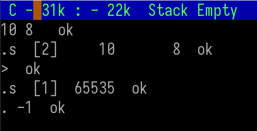

# 基本邏輯判斷

在 F83 環境裡，邏輯判斷（Logical decisions）主要是透過「布林值」與「條件判斷結構」這兩個層次來完成的。

## 布林值的基礎

* TRUE
將布林真值放入堆疊中（在 Forth 中是 -1，所有 bit = 1）。

* FALSE
將布林假值放入堆疊中（在 Forth 中是 0）。

## 比較運算（Relational Operators）

會取出堆疊頂端的數字進行比較，結果是布林值（TRUE / FALSE）。

* =　( n1 n2 -- flag )
相等判斷，若 n1 = n2 → TRUE。

* <>　( n1 n2 -- flag )
不相等判斷。

* <　( n1 n2 -- flag )
小於判斷。

* >　( n1 n2 -- flag )
大於判斷。

* <=　( n1 n2 -- flag )
小於或等於判斷。

* >=　( n1 n2 -- flag )
大於或等於判斷。

* 0=　( n -- flag )
判斷是否為零。

* 0<>　( n -- flag )
判斷是否不為零。

* 0<　( n -- flag )
判斷是否小於零。

* 0>　( n -- flag )
判斷是否大於零。

## 實例教學

1. 直接用 > 比較

```
10 8 > .   \ 輸出結果： -1 (TRUE)
```

說明：10 > 8，成立，Forth 的 TRUE 是 -1，所以會印出 -1。



2. 交換數字，結果不同

```
8 10 > .   \ 輸出結果： 0 (FALSE)
```

說明：8 > 10，不成立，所以輸出 0。


3. 使用 <= 判斷

```
10 8 <= .   \ 輸出結果： 0 (FALSE)
```

說明：10 <= 8，不成立，輸出 0。


4. 如果要搭配印出訊息

Forth 的 字串印出有兩種方式：

* . 會把數字印出來（例如 -1、0）。
* ." 是立即編譯字（immediate word），它會在 編譯狀態下把字串編譯進去，等到 執行時 才會輸出。

而如果我們要印出訊息，則就會在編譯狀態，此時就須要用定義字的方式，來呼叫這段程式來執行，不能直接套用邏輯判斷運算。程式應該要寫成這樣:

```
: LogicTest   10 8 > IF ." 是的，10 比 8 大" ELSE ." 10 沒有比 8 大" THEN ;
```


## 寫一個成績判斷的程式

```
: JUDGE  ( n -- )
   CR
   DUP 60 < IF
      ." 不及格"
   ELSE DUP 70 <= IF
      ." B"
   ELSE DUP 80 <= IF
      ." B+"
   ELSE DUP 90 <= IF
      ." A"
   ELSE DUP 100 <= IF
      ." A+"
   ELSE
      ." 分數錯誤"
   THEN THEN THEN THEN THEN
   DROP CR
;
```

測試程式

```
50 JUDGE    \ 輸出：不及格
65 JUDGE    \ 輸出：B
75 JUDGE    \ 輸出：B+
85 JUDGE    \ 輸出：A
95 JUDGE    \ 輸出：A+
120 JUDGE   \ 輸出：分數錯誤
```

