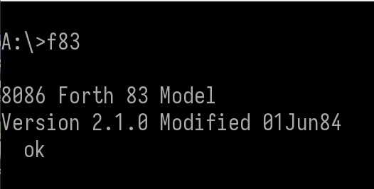

# 安裝 DOSBox-X 軟體

開啟終端機，輸入 `winget search dosbox`，找到 **DOSBox-X** 關鍵字，執行 `winget install install joncampbell123.DOSBox-X` 安裝基礎模擬環境。


第一次進入軟體的畫面如下:


建議先輸入 `cls` 這個 DOS 指令，把畫面清除，讓游標移到畫面上方，方便執行後續的指令。

接著我們要掛載磁碟機上 **F83** 應用軟體的目錄，準備可執行的環境。

`mount a d:\myF83\F83` 這段指令主要是告訴軟體，將 **d:\myF83\F83** 這個目錄掛載到 a 磁碟機，早期的 8086 F83 是使用磁碟機執行的。如果你後續有空查閱原始碼，你會發現很多程式的預設值是直接寫死在 A 磁碟機上。

`a:` 指令是將磁碟機切換至 a 軟碟機。 


`dir/w` 是一個常用的 DOS 指令，用橫列的方式，列出目前檔案夾中有的檔案。


執行 `f83` 就會進入到 F83 軟體中。



覺得畫面訊息太多，可以執行 `dark` 指令，可以清除 F83 的畫面。這個指令很常用，請務必背起來。


一開始我們根本不知道 F83 系統有內建哪些字(WORDS)，可以先執行 `vocs` 指令來查閱大分類，請勿直接執行 `WORDS`，所有的字都印出來，你也不容易觀察哪些字是你需要先瞭解的。此時你可以看到有:

```
SHADOW EDITOR HIDDEN BUG ROOT USER ASSEMBLER DOS FORTH
```

這幾大類的字。

輸入 `VOCS EDITOR WORDS` 就可以列出編輯器相關的字。注意! F83 版的 FORTH 是不區分大小寫的。


`DOS WORDS` 印出 DOS 系統相關的字


`SHADOW WORDS` 印出 SHADOW 相關的字


`HIDDEN WORDS` 印出 HIDDEN 相關的字


